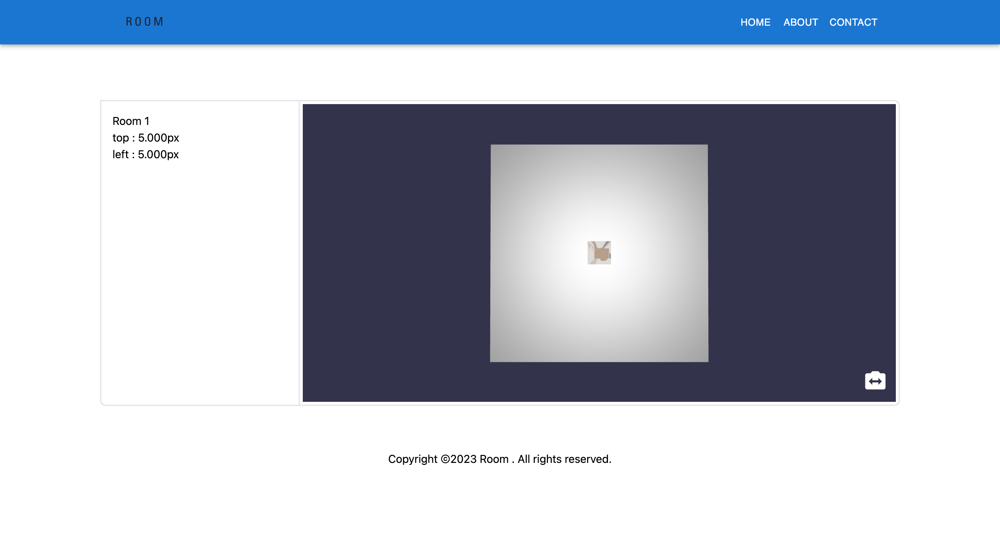

## Simulator room

## About

A demo project showing a simulator room which has a image-based 3D object using BabylonJS



### Environment

|               |         |
| :-----------: | :-----: |
|     React     |  18.x   |
|  Babylon.js   | 5.52.0  |
| React-babylon | 3.1.15  |
|     Vite      |  4.2.0  |
|      Mui      | 5.11.14 |
|  TailwindCSS  |  3.2.7  |

### Usage and Installation

```bash
# Clone the repository
git clone https://github.com/duynhanf/simulator-room

# Install dependencies
yarn install

# Runs the app in the development mode
yarn dev

# testing
yarn test
```
